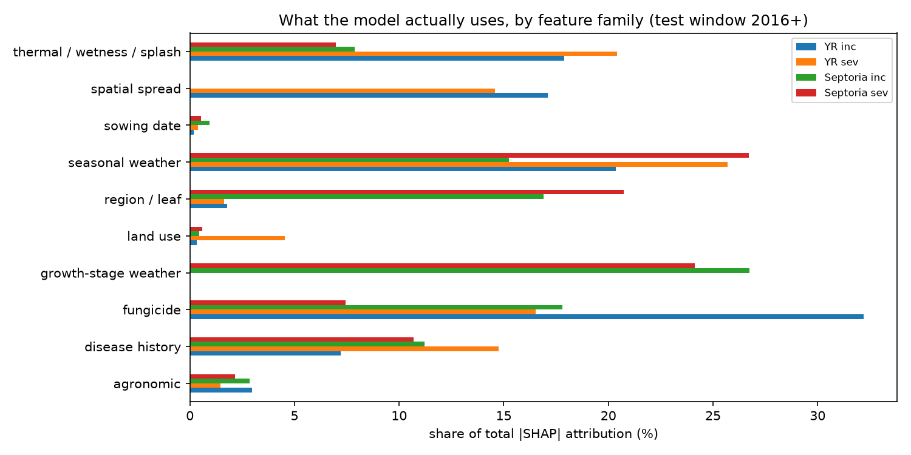

# ADAS pest forecasting

## Summary
Incidence and severity were forecast for *Zymoseptoria tritici* and yellow rust on wheat leaves 1 and 2 across nine UK regions, from a per region-year feature table of weather, sowing date, fungicide use and spatial adjacency. Four learning algorithms (XGBoost, LightGBM, CatBoost, penalised GLM) were compared on identical data, then six forecast methods — naive baselines, machine learning and blends were tested per target. Each target was forecast by whichever method won: XGBoost for Septoria and EWMA smoothing for yellow rust.

## Season window
The season window runs from the 1st October to 20th June. The 1st October approximates the start of sowing and the 20th June is a proxy for the end of assessment.

## Weather data
Daily temperature, precipitation, relative humidity and wind speed data were pulled per region from the Open-Meteo historical API from 1970, then aggregated into seasonal windows.

## Sowing date
The ADAS survey reports the percentage of each region's crop sown in eight weekly bands. These were collapsed into one sowing date per region-year: a percentage-weighted average of band midpoints in days from 1 October, with missing region-years falling back to the all-data mean.

## Disease-favourable weather features
Three features favouring fungal spread:

- Thermal time — cumulative degree-days above a base temperature
- Canopy wetness hours — estimated per day from rainfall and humidity
- Splash risk — rain-driven dispersal of spores onto leaves

Each was accumulated against estimated growth stages (GS31, GS39, GS61, GS75), so weather is measured over the windows that matter for infection.

## Fungicide
DEFRA usage data is published every two years, so dose (kg applied converted to kg per unit area) was smoothed with an exponentially weighted average, then decayed within season to estimate protection at the assessment date.

## Geographic spread
Each region was assigned neighbours, whose previous-year mean disease level was used as a lagged predictor.

## Modelling
**Learning algorithm.** The four algorithms named above were compared on the same feature table. Tree methods were ran across five random seeds so differences could be read against seed noise. This is reproducible via `analysis/evidence/model_comparison.py`, results in `model_comparison_results.csv`.

**Forecast method.** Six methods of turning the algorithms into a forecast were compared: persistence, a 5-year rolling mean, an EWMA smoother, XGBoost on mechanistic features only, XGBoost on all features, and a mechanistic/rolling-mean blend.

Both axes were evaluated by rolling-origin backtesting: training on data up to each origin year O and forecasting O+1, over 30 origins (1996-2025). Tree counts were fixed by early stopping; severity was modelled on a log1p scale, and forecasts seed-averaged and clipped to [0, 100].

No single method won everywhere:

| Target | Forecast method |
| --- | --- |
| Septoria severity | XGBoost, all features |
| Septoria incidence | XGBoost, all features |
| Yellow rust severity | EWMA smoother (α=0.30) |
| Yellow rust incidence | 50/50 mechanistic XGBoost + rolling-mean blend |

## Results

**Algorithm selection.** On test RMSE over the held-out 2016-onward set (mean of 5 seeds), XGBoost, LightGBM and CatBoost performed near-identically — on Septoria severity their spread (2.531-2.547) is within seed noise — with XGBoost modestly ahead elsewhere, so it was carried forward.

**Method selection.** Pooled RMSE over the 30 backtested years; best in bold.

| Method | Septoria severity | Septoria incidence | Yellow rust severity | Yellow rust incidence |
| --- | --- | --- | --- | --- |
| Persistence | 5.57 | 30.93 | 0.073 | 8.08 |
| 5-year rolling mean | 4.19 | 25.11 | 0.061 | 6.88 |
| EWMA (α=0.30) | 4.16 | 24.40 | **0.060** | 6.96 |
| XGBoost, mechanistic features | 3.58 | 21.67 | 0.079 | 6.85 |
| XGBoost, all features | **3.49** | **18.63** | 0.101 | 8.61 |
| Blend, mechanistic + rolling | 3.75 | 21.90 | 0.064 | **6.81** |

**2026 forecast.** Regional mean, with range in brackets.

| Target | Leaf 1 | Leaf 2 |
| --- | --- | --- |
| Septoria incidence (%) | 69.9 (61.7-89.7) | 80.8 (73.7-95.3) |
| Septoria severity (%) | 1.02 (0.59-1.47) | 2.58 (1.61-4.04) |
| Yellow rust incidence (%) | 8.8 (6.6-12.5) | 11.6 (5.7-15.2) |
| Yellow rust severity (%) | 0.02 (0.00-0.08) | 0.04 (0.00-0.11) |

## Uncertainty
Each forecast carries a **split conformal** interval, calibrated backward-looking (year *t* uses only earlier residuals, pooled across regions) on the modelling scale, so severity intervals are asymmetric and non-negative. Out-of-sample coverage over 1616 row-forecasts, 2001-2025, is 78.4% at nominal 80% and 88.5% at 90%; mild under-coverage is expected, as outbreak years break exchangeability.

## SHAP
SHapley Additive Explanations were used to attribute predictions to feature groups, and attribution differs sharply by disease. For Septoria weather dominates: growth-stage weather contributes 24% (severity) and 27% (incidence), with seasonal weather adding 27% and 15%.

The yellow rust models lean far more on fungicide and spatial adjacency: fungicide is the largest group for incidence at 32%, with spatial spread at 17%; for severity, attribution spreads evenly across weather, fungicide, disease history and spatial spread (15-26% each).
